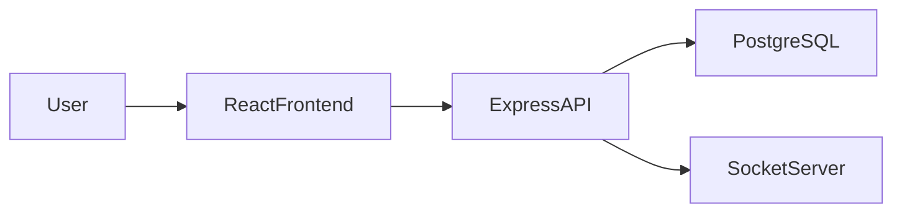
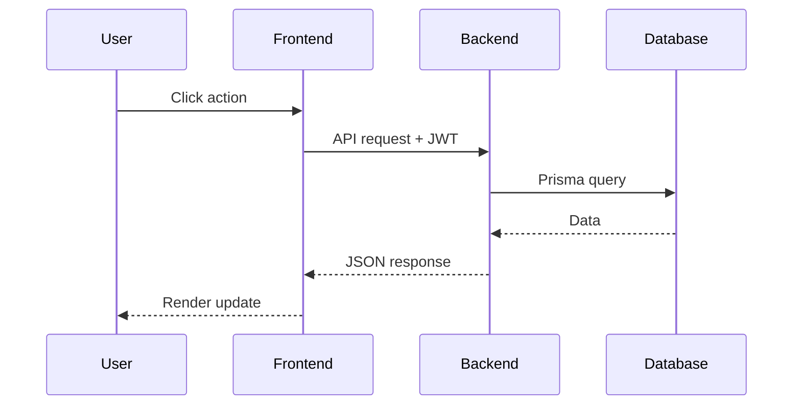
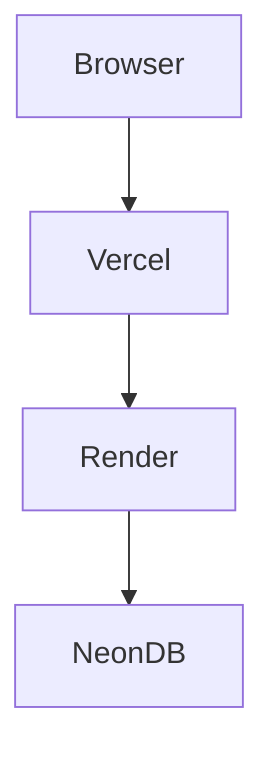
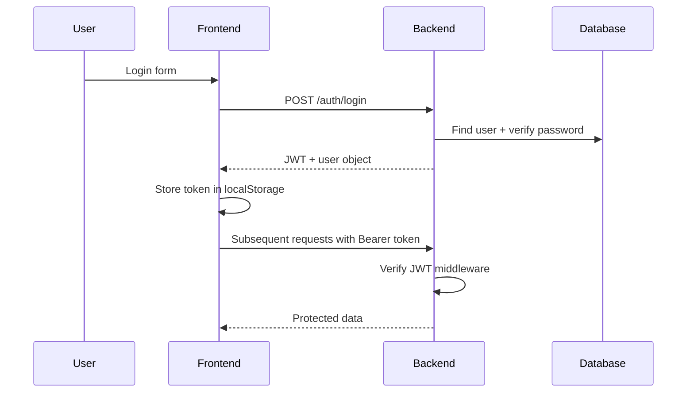
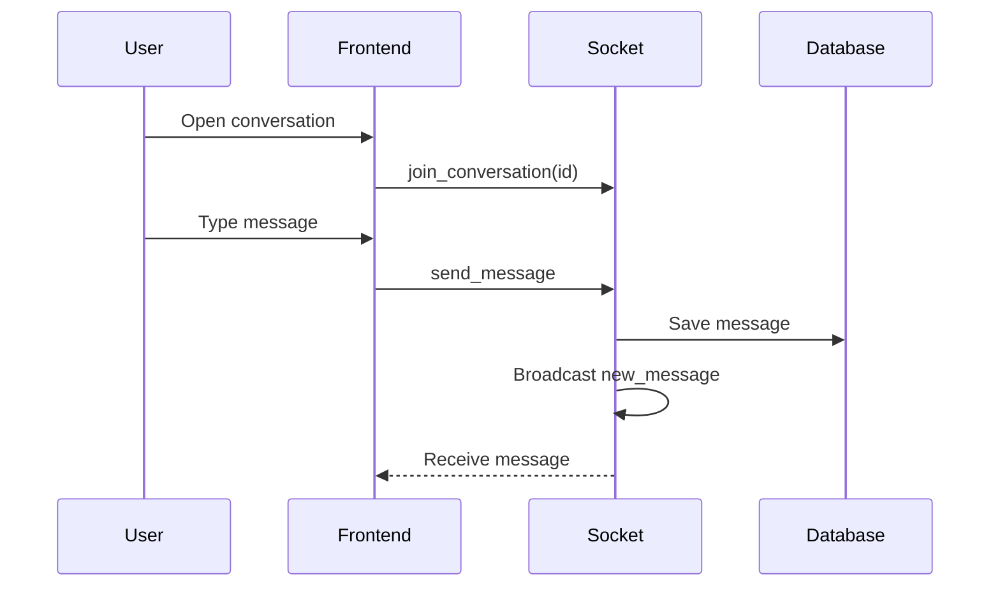
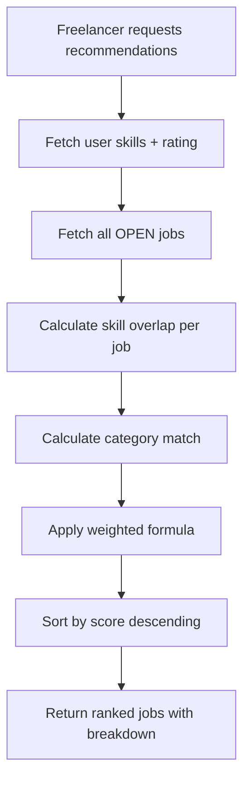

# CampusConnect - Architecture

## System Architecture



## Request Flow



## Deployment Architecture



## Folder Structure

```
campusconnect/
├── client/                 # React frontend
│   ├── src/
│   │   ├── components/     # Reusable UI components
│   │   ├── pages/          # Route pages
│   │   ├── layouts/        # Layout wrappers
│   │   ├── hooks/          # Custom React hooks
│   │   ├── services/       # API client
│   │   ├── context/        # Auth context
│   │   ├── routes/         # Protected route wrapper
│   │   ├── types/          # TypeScript interfaces
│   │   └── utils/          # Helper functions
│   └── vercel.json
├── server/                 # Express backend
│   ├── src/
│   │   ├── routes/         # API route handlers
│   │   ├── middleware/     # Auth middleware
│   │   ├── services/       # Business logic (AI engine)
│   │   ├── socket/         # Socket.io handlers
│   │   ├── utils/          # JWT, Prisma, helpers
│   │   └── types/          # TypeScript declarations
│   └── prisma/
│       ├── schema.prisma   # Database schema
│       └── seed.ts         # Demo data
└── docs/                   # Documentation
```

## Authentication Flow



## Real-time Chat Flow



## AI Recommendation Flow



## Key Design Decisions

1. **Monolithic API** - Single Express server handles all routes and WebSocket connections for simplicity
2. **Prisma ORM** - Type-safe database access with auto-generated client
3. **JWT over sessions** - Stateless auth suitable for deployment across Render instances
4. **Rule-based AI** - Deterministic scoring avoids external API costs and latency
5. **Mock payments** - Simulates full payment lifecycle without PCI compliance requirements
