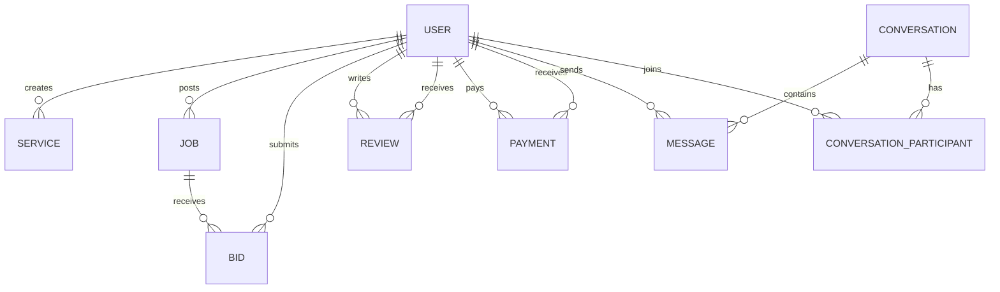

# CampusConnect - Database Design

## ER Diagram

## Models

### User
| Field | Type | Description |
|-------|------|-------------|
| id | String (cuid) | Primary key |
| name | String | Full name |
| email | String (unique) | Email address |
| password | String | Bcrypt hashed |
| role | Enum | FREELANCER, CLIENT, ADMIN |
| bio | String? | Profile bio |
| skills | String[] | Array of skills |
| avatar | String? | Avatar URL |
| rating | Float | Average rating (0-5) |
| createdAt | DateTime | Registration date |

### Service
| Field | Type | Description |
|-------|------|-------------|
| id | String | Primary key |
| title | String | Service title |
| description | String | Service description |
| category | String | Category name |
| price | Float | Price in USD |
| freelancerId | String | FK → User |

### Job
| Field | Type | Description |
|-------|------|-------------|
| id | String | Primary key |
| title | String | Job title |
| description | String | Job description |
| budget | Float | Budget in USD |
| deadline | DateTime | Project deadline |
| category | String | Category name |
| status | Enum | OPEN, IN_PROGRESS, COMPLETED, CANCELLED |
| clientId | String | FK → User |

### Bid
| Field | Type | Description |
|-------|------|-------------|
| id | String | Primary key |
| proposal | String | Bid proposal text |
| quote | Float | Bid amount |
| deliveryDays | Int | Estimated delivery days |
| status | Enum | PENDING, ACCEPTED, REJECTED |
| jobId | String | FK → Job |
| freelancerId | String | FK → User |

Unique constraint: `[jobId, freelancerId]` (one bid per freelancer per job)

### Conversation / ConversationParticipant / Message
- Conversations link two users via participant join table
- Messages belong to conversations with sender reference
- Optional fileUrl for attachments

### Review
| Field | Type | Description |
|-------|------|-------------|
| rating | Int | 1-5 stars |
| comment | String | Review text |
| reviewerId | String | FK → User (writer) |
| revieweeId | String | FK → User (subject) |

Unique constraint: `[reviewerId, revieweeId]`

### Payment
| Field | Type | Description |
|-------|------|-------------|
| amount | Float | Total payment amount |
| commission | Float | Platform fee (15%) |
| status | Enum | PENDING, COMPLETED, FAILED |
| clientId | String | FK → User |
| freelancerId | String | FK → User |
| jobId | String? | Associated job |

## Indexes
- User.email (unique)
- Bid.[jobId, freelancerId] (unique)
- Review.[reviewerId, revieweeId] (unique)
- ConversationParticipant.[conversationId, userId] (unique)

## Seed Data
Demo accounts with password `password123`:
- admin@campusconnect.com (Admin)
- client@campusconnect.com (Client)
- freelancer@campusconnect.com (Freelancer)
- designer@campusconnect.com (Freelancer)
- writer@campusconnect.com (Freelancer)

Includes sample services, jobs, bids, reviews, and messages.
